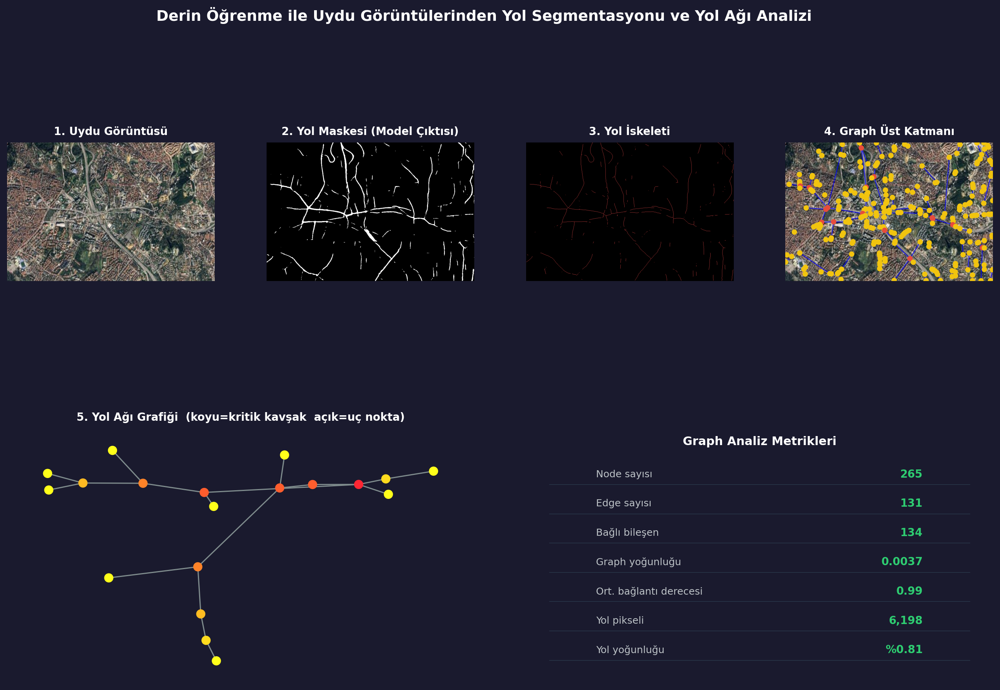

# 🚧 Road Segmentation & Network Graph Analysis from Satellite Imagery

An end-to-end deep learning pipeline for **automatic road extraction** from satellite imagery and **topological road network analysis**.

---

## 📌 Features

- 🔍 **U-Net + ResNet34** based road segmentation  
- 🧩 **Patch-based inference** – supports arbitrarily large satellite images  
- 🧵 **Skeleton extraction** – reduces binary masks to 1-pixel wide road centerlines  
- 🧠 **Graph construction** – converts skeletons into `networkx` graphs with nodes (junctions/endpoints) and edges  
- 📊 **Graph metrics** – node/edge counts, connected components, density, betweenness centrality  
- 🖼️ **Final report** – single-page visualization of all pipeline stages and metrics  

---

## ⚙️ Pipeline Overview

Satellite Image → Segmentation → Binary Mask → Skeleton → Road Graph → Analysis & Report

| Step | Script | Output |
|------|--------|--------|
| 1. Segmentation | `infer_external_image.py` | `outputs/external/latest_mask.png` |
| 2. Skeletonization | `2_skeleton.py` | `outputs/skeleton.npy` |
| 3. Graph Construction | `3_graph.py` | `outputs/road_graph.pkl` |
| 4. Report Generation | `4_report.py` | `outputs/final_report.png` |

---

## 🛠️ Installation

**Requirements**: Python 3.8 or higher.

Clone the repository:

    git clone https://github.com/yourusername/road-segmentation-graph.git
    cd road-segmentation-graph

Install dependencies:

    pip install -r requirements.txt

---

## 📦 Pre-trained Model

The trained model (`best_model.pth`, ~100 MB) is **not** stored in the repository.  
Download it from the Releases page and place it inside the `outputs/` folder.

Example:

    mv ~/Downloads/best_model.pth outputs/

> **Note:** Training is NOT required for inference.

---

## 🚀 Usage

### 1️⃣ Train the Model (Optional)

Requires DeepGlobe Road Extraction dataset.

Organise your data as:

    data/
    └── train/
        ├── image1_sat.jpg
        ├── image1_mask.png
        ├── image2_sat.jpg
        ├── image2_mask.png
        └── ...

Run:

    python 1_segment.py

This will:
- Split data (80% train / 20% validation)
- Train U-Net (~30 epochs)
- Save `best_model.pth` and `best_threshold.txt`
- Generate training curves

---

### 2️⃣ Inference on a New Satellite Image

Place your test image:

    test_images/test1.png

Run the full pipeline:

    python infer_external_image.py
    python 2_skeleton.py
    python 3_graph.py
    python 4_report.py

---

## 📜 Script Descriptions

| Script | Purpose |
|--------|---------|
| `infer_external_image.py` | Patch-based inference on large images |
| `2_skeleton.py` | Mask cleaning + skeleton extraction |
| `3_graph.py` | Node/edge detection + graph construction |
| `4_report.py` | Final visualization & metrics |

---

## 📂 Output Files

| File | Description |
|------|-------------|
| `best_model.pth` | Trained model |
| `best_threshold.txt` | Threshold value |
| `external/latest_input.png` | Input image |
| `external/latest_mask.png` | Predicted mask |
| `skeleton.npy` | Skeleton data |
| `road_graph.pkl` | Graph object |
| `graph.png` | Graph overlay |
| `final_report.png` | Final report |

---

## 🧠 Model Details

| Component | Specification |
|-----------|---------------|
| Architecture | U-Net |
| Encoder | ResNet34 |
| Input Size | 512 × 512 |
| Loss | BCE + Dice + Focal |
| Optimizer | Adam |
| Metric | IoU |

**Typical Performance:**  
Validation IoU ≈ **0.60**

---

## 🌍 Applications

- Smart city planning  
- Disaster response  
- Autonomous navigation  
- GIS analysis  
- Map generation  

---

## 📊 Results

---

## 💡 Key Insight

Transforms pixel-based segmentation into a **graph representation**, enabling **topological analysis** of road networks.

---

## ⚠️ Notes

- Training is optional  
- Model must be downloaded separately  
- Works with any image size (patch-based)  
- Large files are ignored via `.gitignore`  

---

## 📜 License

MIT License

---

## 👤 Author

**Yusuf Karamuk**  

GitHub: https://github.com/YusufKaramuk1
